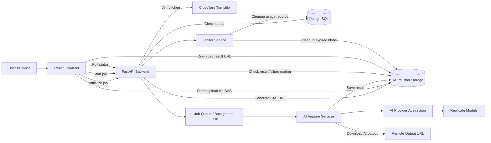
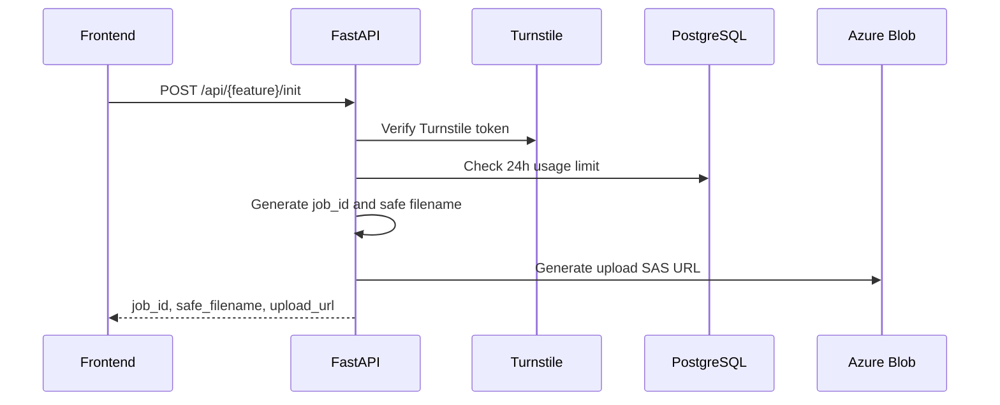
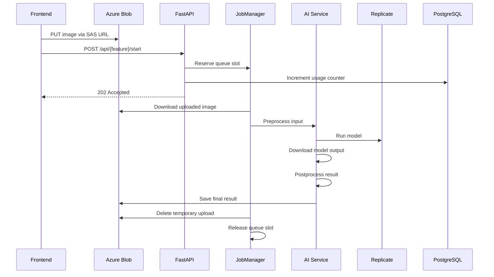
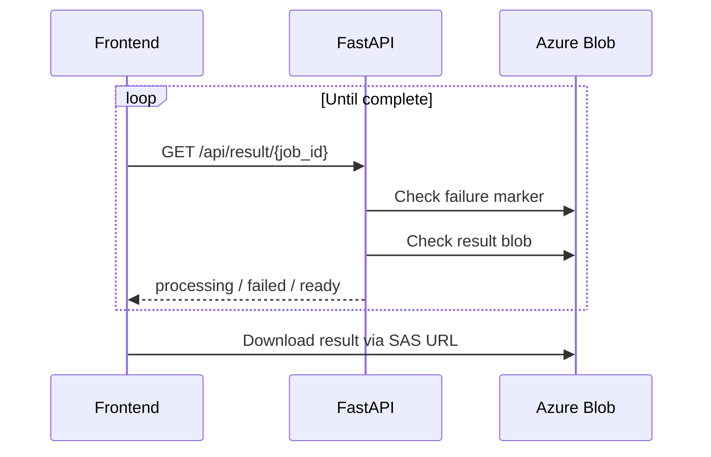
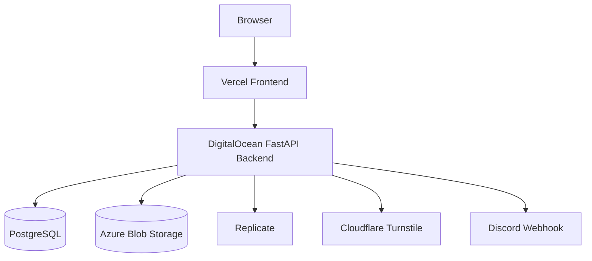

<div align="center">

[EN](../../ARCHITECTURE.md) | [中文](./ARCHITECTURE_ZH.md) | ID

</div>

# Arsitektur PixelForge

PixelForge adalah studio gambar open-source yang menyediakan alat gambar berbasis browser dan pemrosesan gambar berbantuan AI melalui frontend React dan backend FastAPI.

Sistem ini dirancang dengan pemisahan tanggung jawab yang jelas:

- **Frontend:** antarmuka pengguna, alat client-side, alur upload, UI progres, dan polling.
- **Backend:** inisialisasi job yang aman, usage limit, URL upload cloud, orkestrasi job AI, eksekusi provider, penyimpanan hasil, dan cleanup.
- **Layanan cloud:** Azure Blob Storage untuk upload/hasil sementara, Replicate untuk inferensi AI, PostgreSQL untuk pelacakan usage, Cloudflare Turnstile untuk proteksi bot, dan Discord webhook untuk notifikasi feedback.

---

## 1. Gambaran Sistem Tingkat Tinggi



---

## 2. Technology Stack

### Frontend

- React
- Vite
- React Router
- Tailwind CSS
- Framer Motion
- Cloudflare Turnstile widget
- Utilitas gambar client-side untuk alat non-AI

### Backend

- FastAPI
- Uvicorn
- Pydantic Settings
- SlowAPI rate limiting
- asyncpg
- Azure Blob Storage SDK
- Replicate Python SDK
- Pillow / utilitas validasi gambar
- httpx / aiohttp

### Infrastruktur dan Layanan Eksternal

- Azure Blob Storage
- PostgreSQL
- Replicate
- Cloudflare Turnstile
- Discord webhook
- Deployment frontend Vercel
- Deployment backend DigitalOcean

---

## 3. Struktur Repository

```txt
PixelForge/
├── backend/
│   ├── api/
│   │   ├── routes/
│   │   └── schemas/
│   ├── app/
│   │   ├── factory.py
│   │   ├── lifecycle.py
│   │   ├── logging/
│   │   ├── middleware.py
│   │   └── routers.py
│   ├── core/
│   │   ├── config.py
│   │   ├── model_registry.py
│   │   └── security.py
│   ├── database/
│   │   └── db_pool.py
│   ├── domain/
│   │   └── ai_features.py
│   ├── limiter/
│   │   ├── rate_limiter.py
│   │   └── usage_service.py
│   ├── provider/
│   │   ├── ai_provider.py
│   │   └── replicate_client.py
│   ├── repository/
│   │   └── usage_repo.py
│   ├── services/
│   │   ├── ai/
│   │   ├── azure/
│   │   ├── job/
│   │   ├── maintenance/
│   │   ├── notification/
│   │   └── security/
│   ├── scripts/
│   └── utils/
│
├── frontend/
│   ├── src/
│   │   ├── components/
│   │   ├── data/
│   │   ├── hooks/
│   │   ├── pages/
│   │   ├── services/
│   │   ├── utils/
│   │   ├── App.jsx
│   │   ├── config.js
│   │   ├── main.jsx
│   │   └── routes.js
│   ├── public/
│   └── vite.config.js
│
└── docs/
```

---

## 4. Arsitektur Frontend

Frontend disusun di sekitar komponen workspace yang reusable dan halaman feature-specific.

### 4.1 Application Shell

`frontend/src/App.jsx` memiliki tanggung jawab utama layout aplikasi:

- Browser routing
- Navigasi global
- Global header
- Footer dan legal modal
- FAQ chatbot widget
- Suspense loader untuk halaman lazy-loaded

Routes didefinisikan secara terpusat di:

```txt
frontend/src/routes.js
```

Setiap route melakukan lazy import terhadap page component untuk menjaga initial bundle size lebih kecil.

---

### 4.2 Kategori Halaman

Halaman frontend dikelompokkan berdasarkan jenis tool:

```txt
pages/
├── AiFeatures/
│   ├── UpscaleImage.jsx
│   ├── RemoveBackground.jsx
│   ├── ColorRestoration.jsx
│   └── ObjectRemover.jsx
├── SmartEdit/
│   ├── ImageEditor.jsx
│   ├── ResizeImage.jsx
│   ├── CropImage.jsx
│   └── RotateFlip.jsx
├── Optimize/
│   ├── CompressImage.jsx
│   ├── ConvertFormat.jsx
│   └── MetadataWorkspace.jsx
├── Utilities/
│   ├── ColorPalette.jsx
│   └── WatermarkAdder.jsx
└── Special/
    ├── ComingSoon.jsx
    ├── FaqChatbotWidget.jsx
    └── NotFound.jsx
```

---

### 4.3 Halaman Fitur AI

Halaman fitur AI menggunakan shared workspace component:

```txt
components/Workspace/AiFeatureWorkspace.jsx
```

Setiap halaman AI menghubungkan bagian khusus fitur ke shared workspace:

| Page | Pipeline Hook | Controls | Feature Key |
|---|---|---|---|
| `UpscaleImage.jsx` | `useUpscalePipeline` | `UpscaleControls` | `upscale` |
| `RemoveBackground.jsx` | `useRemBGPipeline` | `RemoveBgControls` | `rembg` |
| `ColorRestoration.jsx` | `useColorRestorePipeline` | `ColorRestoreControls` | `colorrestore` |
| `ObjectRemover.jsx` | `useObjectRemovePipeline` | `ObjectRemoveControls` + mask canvas | `objectremove` |

Halaman AI sengaja dibuat tipis. Halaman hanya memiliki state UI spesifik seperti progress, scale, brush size, dan mask readiness. Shared pipeline hooks memiliki state upload, polling, cancellation, Turnstile token, result URL, dan usage-limit.

---

### 4.4 Frontend Pipeline Hooks

Workflow AI diabstraksikan melalui pipeline dan action hooks:

```txt
hooks/
├── actions/
│   ├── useActions.js
│   ├── useUpscaleActions.js
│   ├── useRemBGActions.js
│   ├── useColorRestoreActions.js
│   └── useObjectRemoveActions.js
├── pipeline/
│   ├── usePipeline.js
│   ├── useUpscalePipeline.js
│   ├── useRemBGPipeline.js
│   ├── useColorRestorePipeline.js
│   └── useObjectRemovePipeline.js
└── auth/
    └── useUsageLimit.js
```

Pipeline generik menangani perilaku bersama:

- State file terpilih
- State preview URL
- Penanganan Turnstile token
- Start job
- Polling
- State result URL
- Cancel behavior
- State tampilan usage limit
- State alert

Feature-specific action hook menangani API call dan perbedaan payload.

---

### 4.5 Client-Side Tools

Tool non-AI sebagian besar berjalan di browser dan menggunakan client hooks/utilities:

```txt
hooks/client/
hooks/workspace/
utils/image/
utils/file/
utils/storage/
```

Contoh:

- Image resize
- Image crop
- Rotate dan flip
- Compression
- Format conversion
- Metadata removal
- Watermark rendering
- Color palette extraction

Ini membuat operasi gambar ringan tetap cepat, privat, dan tidak bergantung pada job AI backend.

---

## 5. Arsitektur Backend

Backend mengikuti arsitektur FastAPI berlapis.

```txt
app factory
   ↓
middleware + routers
   ↓
routes / schemas
   ↓
services
   ↓
provider / repository / storage
   ↓
external systems
```

---

### 5.1 Application Factory

Aplikasi backend dibuat melalui:

```txt
backend/app/factory.py
```

Tanggung jawab:

- Mengonfigurasi logging
- Memvalidasi environment setting penting
- Membuat FastAPI app
- Mendaftarkan middleware
- Mendaftarkan routers
- Menambahkan behavior startup/shutdown melalui lifespan

---

### 5.2 Lifespan

Lifecycle aplikasi dikelola di:

```txt
backend/app/lifecycle.py
```

Startup:

- Inisialisasi PostgreSQL connection pool
- Menjalankan janitor background task

Shutdown:

- Membatalkan janitor task
- Menutup PostgreSQL pool

---

### 5.3 Middleware

Middleware dikonfigurasi di:

```txt
backend/app/middleware.py
```

Perilaku yang dikonfigurasi:

- Request logging
- CORS
- SlowAPI rate-limit exception handling

---

### 5.4 Routes

Routes dikelompokkan berdasarkan concern:

```txt
backend/api/routes/
├── router.py
├── ai_tools/
│   ├── upscale.py
│   ├── rembg.py
│   ├── color_restore.py
│   └── object_remove.py
├── jobs/
│   └── ai_jobs.py
├── ops/
│   └── health.py
└── public/
    └── feedback.py
```

Endpoint job bersama:

| Endpoint | Tujuan |
|---|---|
| `POST /{feature}/init` | Verifikasi client, cek quota, buat job ID, return SAS upload URL |
| `POST /upscale/start` | Queue upscale job |
| `POST /rembg/start` | Queue background-removal job |
| `POST /colorrestore/start` | Queue color-restoration job |
| `POST /objectremove/start` | Queue object-removal job |
| `GET /result/{job_id}` | Cek apakah result ready, failed, atau processing |
| `GET /usage?feature=...` | Return status usage saat ini |
| `POST /feedback` | Submit feedback ke Discord webhook |
| `GET /` | Health check |

---

## 6. Lifecycle Job AI

Job AI menggunakan workflow dua fase.

### Fase 1: Initialize



Initialization tidak menjalankan model AI. Fase ini hanya menyiapkan upload yang aman dan memvalidasi bahwa request diperbolehkan.

---

### Fase 2: Upload dan Start



---

### Fase 3: Poll Result



---

## 7. Layer Service Fitur AI

Service fitur AI berada di:

```txt
backend/services/ai/
├── features/
│   ├── upscale.py
│   ├── bg_remover.py
│   ├── color_restorer.py
│   └── object_remover.py
└── pipeline/
    └── image_pipeline_service.py
```

Semua fitur AI menggunakan `ImagePipelineService`, yang mengimplementasikan template method pipeline:

1. Download upload bytes dari Azure
2. Validasi input size
3. Preprocess input
4. Eksekusi remote model
5. Download remote result
6. Postprocess output
7. Validasi output size
8. Simpan final result ke Azure

Feature services hanya override bagian yang mereka perlukan:

| Service | Perilaku Khusus |
|---|---|
| `AIUpscaler` | Downscale sebelum model, compress/cap output |
| `BackgroundRemover` | Downscale input, output WEBP dengan alpha |
| `ColorRestorer` | Validasi grayscale input sebelum model |
| `ObjectRemover` | Load mask image dan kirim image + mask ke model |

---

## 8. Arsitektur Provider

Abstraksi AI provider berada di:

```txt
backend/provider/
├── ai_provider.py
└── replicate_client.py
```

`BaseAIProvider` mendefinisikan kontrak provider.

`ReplicateProvider` mengimplementasikan kontrak tersebut menggunakan Replicate.

Desain ini memungkinkan provider masa depan, seperti RunPod atau layanan inference lain, ditambahkan tanpa menulis ulang feature services.

---

## 9. Model Registry

Identifier model dan key khusus provider dipusatkan di:

```txt
backend/core/model_registry.py
```

Registry menyimpan:

- Replicate model IDs
- Parameter default model
- Input key names
- Mask key names untuk object removal

Ini mencegah detail provider tersebar di seluruh aplikasi.

---

## 10. Arsitektur Storage

Azure Blob Storage dikelola melalui:

```txt
backend/services/azure/
├── storage.py
└── storage_utils.py
```

Backend menggunakan dua container:

| Container | Tujuan |
|---|---|
| `uploads` | Source image sementara dan mask object-removal |
| `results` | Output AI yang sudah diproses dan failure marker |

Tanggung jawab storage:

- Generate write-only upload SAS URL
- Generate read-only result SAS URL
- Download uploaded file untuk backend processing
- Save processed result
- Delete temporary uploads
- Store failure markers
- Cleanup expired results

---

## 11. Usage Limits dan Rate Limiting

Usage tracking dipisahkan di:

```txt
backend/limiter/
├── rate_limiter.py
└── usage_service.py

backend/repository/
└── usage_repo.py
```

### Rate Limiting

SlowAPI membatasi request berdasarkan client IP yang sudah di-resolve.

Urutan resolusi client IP:

1. `CF-Connecting-IP`
2. `X-Forwarded-For`
3. `X-Real-IP`
4. request peer host

### Usage Limits

Usage dilacak per IP dan feature:

```txt
{client_ip}:{feature}
```

Usage record disimpan per jam di:

```sql
ip_usage_hourly
```

Ini mendukung rolling 24-hour usage window sekaligus menjaga cleanup tetap sederhana.

---

## 12. Queue dan Job Management

Orkestrasi job ditangani oleh:

```txt
backend/services/job/
├── job_initializer.py
├── job_dispatcher.py
├── job_manager.py
└── queue_service.py
```

### JobInitializer

Menyiapkan job sebelum processing:

- Verify Turnstile
- Check daily usage
- Generate job ID
- Generate safe filenames
- Generate upload SAS URLs

### JobDispatcher

Digunakan oleh route handler untuk:

- Resolve client IP
- Reserve queue capacity
- Add background task
- Return response `202 Accepted` yang konsisten

### JobManager

Memiliki processing lifecycle:

- Reserve queue slot
- Increment usage
- Execute feature service
- Delete temporary upload
- Mark failed jobs
- Refund usage on failure
- Release queue slot

### QueueService

Melacak active jobs secara in-process dan mencegah backend process overload.

---

## 13. Arsitektur Keamanan

Keamanan PixelForge berfokus pada pembatasan abuse, upload tidak aman, dan exposure yang tidak disengaja.

### Bot Protection

Cloudflare Turnstile melindungi job initialization dan feedback submission.

Manual bypass hanya tersedia untuk environment local/development ketika diaktifkan secara eksplisit.

### File Safety

Backend memvalidasi dan membatasi data upload melalui:

- MIME/type validation
- Safe generated filenames
- File size limits
- Image resolution limits
- Pixel safety limits
- Controlled CPU concurrency
- Azure SAS expiration

### Storage Safety

Frontend upload langsung ke Azure menggunakan short-lived SAS URL. Backend membuat filename menggunakan job ID sehingga tidak bergantung pada path dari client.

### Usage Protection

Feature usage limits mencegah satu client melakukan panggilan AI tanpa batas.

### Cleanup

Temporary upload dan result dihapus otomatis oleh job flow dan janitor service.

---

## 14. Feedback Flow

Feedback submission menggunakan:

```txt
frontend feedback form
   ↓
POST /api/feedback
   ↓
Turnstile verification
   ↓
usage/rate limit
   ↓
Discord webhook
```

Feedback service membuat Discord embed dan mengirimkannya secara asinkron.

---

## 15. Logging

Logging dikonfigurasi di:

```txt
backend/app/logging/
├── logging_config.py
├── logging_formatter.py
└── request_logging.py
```

Fitur logging:

- Format timestamp/severity/component yang konsisten
- Console output
- Optional rotating file logs
- Noise dari third-party libraries dikurangi
- Request duration logging

Contoh bentuk log:

```txt
2026-01-01 12:00:00 | INFO     | job-manager            | upscale done job=...
```

---

## 16. Cleanup dan Maintenance

Janitor service berjalan di lifespan aplikasi.

Tanggung jawab:

- Menghapus Azure result blobs yang kedaluwarsa
- Menghapus usage tracking records lama

Script reset untuk local development:

```txt
backend/scripts/reset_usage.py
```

hanya mereset usage counters di environment development yang diperbolehkan.

---

## 17. Konfigurasi Environment

Konfigurasi runtime dipusatkan di:

```txt
backend/core/config.py
```

Environment variables penting:

```txt
DATABASE_URL
AZURE_CONNECTION_STRING
CLOUDFLARE_TURNSTILE_SECRET_KEY
DISCORD_WEBHOOK_URL
REPLICATE_API_TOKEN
ALLOWED_ORIGINS
```

Limit penting:

```txt
UPLOAD_RATE_LIMIT
POLL_RATE_LIMIT
FEEDBACK_RATE_LIMIT

UPSCALE_DAILY_USAGE_LIMIT
REMBG_DAILY_USAGE_LIMIT
COLOR_RESTORE_DAILY_USAGE_LIMIT
OBJECT_REMOVE_DAILY_USAGE_LIMIT
FEEDBACK_DAILY_USAGE_LIMIT

MAX_FILE_SIZE_MB
MAX_MEGAPIXELS
MAX_IMAGE_DIMENSION
MAX_CONCURRENT_JOBS
MAX_CONCURRENT_CPU_JOBS
```

---

## 18. Model Deployment



Frontend dan backend dideploy secara terpisah.

Frontend memanggil backend melalui API base URL yang dikonfigurasi. Backend menangani CORS menggunakan allowed origins yang dikonfigurasi.

---

## 19. Prinsip Desain

PixelForge mengikuti prinsip arsitektur berikut:

1. **Thin routes**  
   Route handler memvalidasi request shape dan mendelegasikan ke service.

2. **Shared pipelines**  
   Logika workflow AI yang berulang berada di shared image pipeline.

3. **Feature-specific hooks**  
   Halaman frontend tetap readable dengan mendelegasikan API workflow ke hooks.

4. **Provider abstraction**  
   AI services tidak bergantung langsung pada kode spesifik Replicate.

5. **Secure temporary storage**  
   Uploads dan results bersifat short-lived dan cleanup-aware.

6. **Fail-safe cleanup**  
   Failed jobs membuat markers, refund usage, dan release queue slots.

7. **Local development safety**  
   Script destruktif dijaga oleh environment checks.

---

## 20. Menambahkan Fitur AI Baru

Untuk menambahkan fitur AI baru:

1. Tambahkan feature key ke backend domain type.
2. Tambahkan usage limit ke settings.
3. Register model di `ModelRegistry`.
4. Buat feature service di `services/ai/features`.
5. Tambahkan request schemas jika diperlukan.
6. Tambahkan route di `api/routes/ai_tools`.
7. Masukkan route ke central API router.
8. Tambahkan frontend service/action hook.
9. Tambahkan frontend pipeline hook.
10. Tambahkan feature page dan controls.
11. Tambahkan navigation dan marketing data.
12. Tambahkan usage/progress labels.

Pola yang direkomendasikan:

```txt
backend feature service
   ↓
backend route
   ↓
frontend service function
   ↓
frontend action hook
   ↓
frontend pipeline hook
   ↓
frontend page
```

---

## 21. Catatan Arsitektur yang Diketahui

- `QueueService` bersifat process-local. Jika backend dijalankan dalam beberapa instance, setiap instance memiliki queue counter sendiri.
- Azure SAS URLs bersifat short-lived dan tidak boleh disimpan jangka panjang.
- Frontend tidak boleh mengirim secrets. Semua provider tokens dan Azure credentials tetap berada di backend.
- Client-side tools sebaiknya tetap browser-only kecuali membutuhkan AI processing.
- Direct upload menjaga transfer file besar agar tidak melewati request body backend.

---

## 22. Peta Dokumentasi

Dokumentasi PixelForge dikelompokkan berdasarkan audiens dan tujuan.

```txt
Dokumentasi komunitas root:
README.md
CONTRIBUTING.md
CODE_OF_CONDUCT.md
SECURITY.md
LICENSE

Dokumentasi developer:
docs/
├── ARCHITECTURE.md
├── ADDING_AI_FEATURE.md
├── assets/
│   ├── TECH_STACKS.png
│   └── tech_stacks_generator.html
└── translation/
    ├── landing/
    │   ├── README_ID.md
    │   └── README_CN.md
    ├── dev/
    │   ├── ADDING_AI_FEATURE_ID.md
    │   ├── ADDING_AI_FEATURE_ZH.md
    │   ├── ARCHITECTURE_ID.md
    │   └── ARCHITECTURE_ZH.md
    └── community/
        ├── CONTRIBUTING_ID.md
        ├── CONTRIBUTING_ZH.md
        ├── CODE_OF_CONDUCT_ID.md
        ├── CODE_OF_CONDUCT_ZH.md
        ├── SECURITY_ID.md
        └── SECURITY_ZH.md
```

Dokumentasi yang direkomendasikan untuk ditambahkan nanti:

```txt
docs/
├── API.md
├── DEPLOYMENT.md
└── TESTING.md
```

`ARCHITECTURE.md` sebaiknya tetap high-level. Detail implementasi sebaiknya berada di module docstring dan panduan khusus fitur.
