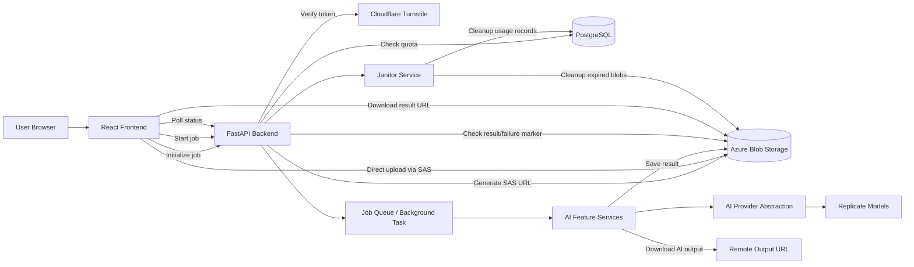
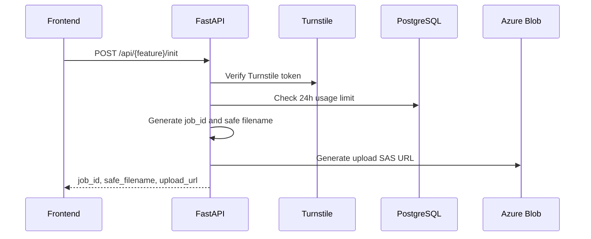
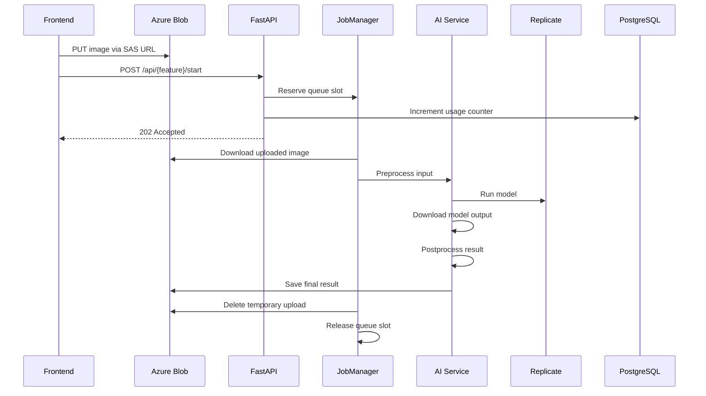
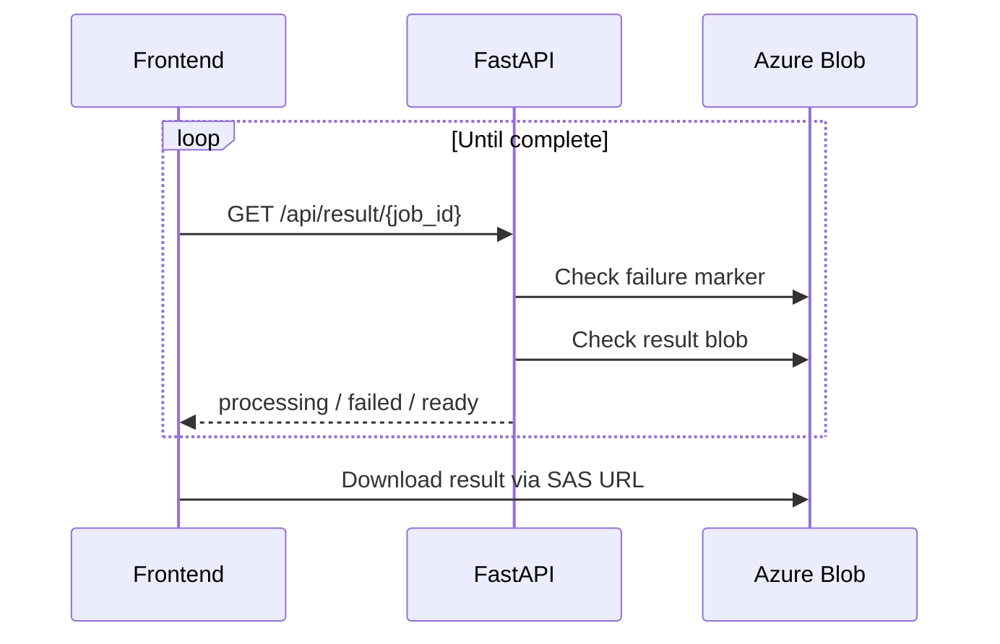
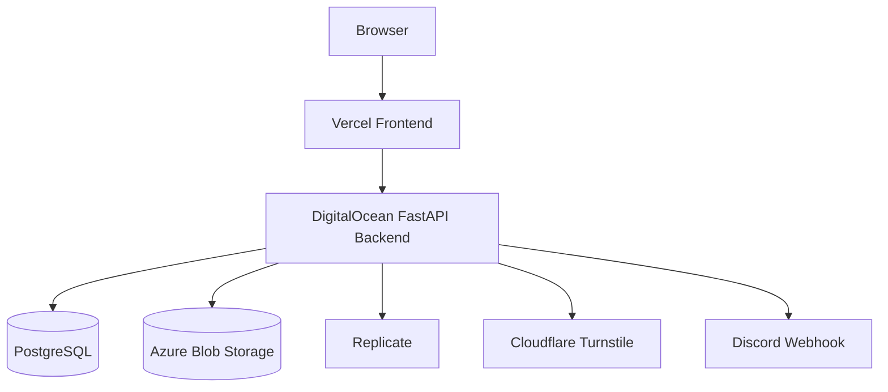

<div align="center">

[EN](../../ARCHITECTURE.md) | 中文 | [ID](./ARCHITECTURE_ID.md)

</div>

# PixelForge 架构

PixelForge 是一个开源图片工作室，通过 React 前端与 FastAPI 后端提供浏览器端图像工具和 AI 辅助图像处理能力。

系统围绕清晰的职责拆分进行设计：

- **前端：** 用户界面、浏览器端工具、上传流程、进度 UI 与状态轮询。
- **后端：** 安全任务初始化、使用限制、云端上传 URL、AI 任务编排、Provider 执行、结果存储与清理。
- **云服务：** Azure Blob Storage 用于临时上传/结果，Replicate 用于 AI 推理，PostgreSQL 用于使用量统计，Cloudflare Turnstile 用于机器人防护，Discord Webhook 用于反馈通知。

---

## 1. 高层系统概览



---

## 2. 技术栈

### 前端

- React
- Vite
- React Router
- Tailwind CSS
- Framer Motion
- Cloudflare Turnstile widget
- 非 AI 工具使用的浏览器端图像工具函数

### 后端

- FastAPI
- Uvicorn
- Pydantic Settings
- SlowAPI rate limiting
- asyncpg
- Azure Blob Storage SDK
- Replicate Python SDK
- Pillow / 图像验证工具
- httpx / aiohttp

### 基础设施与外部服务

- Azure Blob Storage
- PostgreSQL
- Replicate
- Cloudflare Turnstile
- Discord webhook
- Vercel 前端部署
- DigitalOcean 后端部署

---

## 3. 仓库结构

```txt
PixelForge/
├── backend/
│   ├── api/
│   │   ├── routes/
│   │   └── schemas/
│   ├── app/
│   │   ├── factory.py
│   │   ├── lifecycle.py
│   │   ├── logging/
│   │   ├── middleware.py
│   │   └── routers.py
│   ├── core/
│   │   ├── config.py
│   │   ├── model_registry.py
│   │   └── security.py
│   ├── database/
│   │   └── db_pool.py
│   ├── domain/
│   │   └── ai_features.py
│   ├── limiter/
│   │   ├── rate_limiter.py
│   │   └── usage_service.py
│   ├── provider/
│   │   ├── ai_provider.py
│   │   └── replicate_client.py
│   ├── repository/
│   │   └── usage_repo.py
│   ├── services/
│   │   ├── ai/
│   │   ├── azure/
│   │   ├── job/
│   │   ├── maintenance/
│   │   ├── notification/
│   │   └── security/
│   ├── scripts/
│   └── utils/
│
├── frontend/
│   ├── src/
│   │   ├── components/
│   │   ├── content/
│   │   │   ├── bot/
│   │   │   ├── feature/
│   │   │   ├── modals/
│   │   │   └── navigation/
│   │   ├── hooks/
│   │   ├── pages/
│   │   ├── routes/
│   │   ├── services/
│   │   ├── utils/
│   │   ├── App.jsx
│   │   ├── config.js
│   │   ├── main.jsx
│   │   └── routes.js
│   ├── public/
│   └── vite.config.js
│
└── docs/
```

---

## 4. 前端架构

前端围绕可复用 workspace 组件和功能页面进行组织。

### 4.1 应用外壳

`frontend/src/App.jsx` 负责主应用布局：

- 浏览器路由
- 全局导航
- 全局 Header
- Footer 与法律模态框
- FAQ 聊天机器人组件
- 懒加载页面的 Suspense loader

Routes 按类别分组在：

```txt
frontend/src/routes/
```

根 route 文件仍然保留为 facade：

```txt
frontend/src/routes.js
```

`App.jsx` 只导入这个 facade，而 facade 会组合来自不同类别的 route arrays，例如 AI features、smart edit tools、optimize tools、utilities、landing pages 和 special pages。每个 route 仍然使用 lazy import 加载对应 page component，以减小 initial bundle size。

---

### 4.2 页面分类

前端页面按工具类型分组：

```txt
pages/
├── AiFeatures/
│   ├── UpscaleImage.jsx
│   ├── RemoveBackground.jsx
│   ├── ColorRestoration.jsx
│   └── ObjectRemover.jsx
├── SmartEdit/
│   ├── ImageEditor.jsx
│   ├── ResizeImage.jsx
│   ├── CropImage.jsx
│   └── RotateFlip.jsx
├── Optimize/
│   ├── CompressImage.jsx
│   ├── ConvertFormat.jsx
│   └── MetadataWorkspace.jsx
├── Utilities/
│   ├── ColorPalette.jsx
│   └── WatermarkAdder.jsx
└── Special/
    ├── ComingSoon.jsx
    ├── FaqChatbotWidget.jsx
    └── NotFound.jsx
```

---

### 4.3 AI 功能页面

AI 功能页面使用共享 workspace 组件：

```txt
components/Workspace/AiFeatureWorkspace.jsx
```

每个 AI 页面都会将特定功能所需的内容接入共享 workspace：

| 页面 | Pipeline Hook | 控制组件 | Feature Key |
|---|---|---|---|
| `UpscaleImage.jsx` | `useUpscalePipeline` | `UpscaleControls` | `upscale` |
| `RemoveBackground.jsx` | `useRemBGPipeline` | `RemoveBgControls` | `rembg` |
| `ColorRestoration.jsx` | `useColorRestorePipeline` | `ColorRestoreControls` | `colorrestore` |
| `ObjectRemover.jsx` | `useObjectRemovePipeline` | `ObjectRemoveControls` + mask canvas | `objectremove` |

AI 页面刻意保持轻量。页面只负责进度、scale、brush size、mask readiness 等页面级状态；共享 pipeline hook 负责上传、轮询、取消、Turnstile token、结果 URL 与使用限制状态。

---

### 4.4 前端 Pipeline Hooks

AI 工作流通过 pipeline 和 action hooks 抽象：

```txt
hooks/
├── actions/
│   ├── useActions.js
│   ├── useUpscaleActions.js
│   ├── useRemBGActions.js
│   ├── useColorRestoreActions.js
│   └── useObjectRemoveActions.js
├── pipeline/
│   ├── usePipeline.js
│   ├── useUpscalePipeline.js
│   ├── useRemBGPipeline.js
│   ├── useColorRestorePipeline.js
│   └── useObjectRemovePipeline.js
└── auth/
    └── useUsageLimit.js
```

通用 pipeline 处理共享行为：

- 选择文件状态
- 预览 URL 状态
- Turnstile token 处理
- 启动任务
- 轮询结果
- 结果 URL 状态
- 取消行为
- 使用限制显示状态
- Alert 状态

功能专属 action hook 负责 API 调用和 payload 差异。

---

### 4.5 浏览器端工具

非 AI 工具大多直接在浏览器中运行，并使用 client hooks/utilities：

```txt
hooks/client/
hooks/workspace/
utils/image/
utils/file/
utils/storage/
```

示例：

- 图像 resize
- 图像 crop
- 旋转与翻转
- 压缩
- 格式转换
- 元数据移除
- 水印渲染
- 调色板提取

这让轻量图像操作保持快速、私密，并且不依赖后端 AI 任务。

---

## 5. 后端架构

后端遵循分层 FastAPI 架构。

```txt
app factory
   ↓
middleware + routers
   ↓
routes / schemas
   ↓
services
   ↓
provider / repository / storage
   ↓
external systems
```

---

### 5.1 Application Factory

后端应用通过以下文件创建：

```txt
backend/app/factory.py
```

职责：

- 配置日志
- 验证关键环境变量
- 创建 FastAPI app
- 注册 middleware
- 注册 routers
- 挂载 lifespan 启动/关闭行为

---

### 5.2 Lifespan

应用生命周期由以下文件管理：

```txt
backend/app/lifecycle.py
```

启动时：

- 初始化 PostgreSQL connection pool
- 启动 janitor 后台任务

关闭时：

- 取消 janitor 任务
- 关闭 PostgreSQL pool

---

### 5.3 Middleware

Middleware 配置在：

```txt
backend/app/middleware.py
```

配置内容：

- 请求日志
- CORS
- SlowAPI rate-limit exception handling

---

### 5.4 Routes

Routes 按关注点分组：

```txt
backend/api/routes/
├── router.py
├── ai_tools/
│   ├── upscale.py
│   ├── rembg.py
│   ├── color_restore.py
│   └── object_remove.py
├── jobs/
│   └── ai_jobs.py
├── ops/
│   └── health.py
└── public/
    └── feedback.py
```

共享任务端点：

| Endpoint | 作用 |
|---|---|
| `POST /{feature}/init` | 验证客户端、检查配额、创建 job ID、返回 SAS upload URL |
| `POST /upscale/start` | 将 upscale job 加入队列 |
| `POST /rembg/start` | 将 background-removal job 加入队列 |
| `POST /colorrestore/start` | 将 color-restoration job 加入队列 |
| `POST /objectremove/start` | 将 object-removal job 加入队列 |
| `GET /result/{job_id}` | 检查结果 ready、failed 或 processing |
| `GET /usage?feature=...` | 返回当前使用状态 |
| `POST /feedback` | 将反馈提交到 Discord webhook |
| `GET /` | 健康检查 |

---

## 6. AI 任务生命周期

AI 任务使用两阶段工作流。

### 阶段 1：初始化



初始化不会运行 AI 模型。它只负责准备安全上传信息，并验证请求是否被允许。

---

### 阶段 2：上传并启动



---

### 阶段 3：轮询结果



---

## 7. AI 功能服务层

AI 功能服务位于：

```txt
backend/services/ai/
├── features/
│   ├── upscale.py
│   ├── bg_remover.py
│   ├── color_restorer.py
│   └── object_remover.py
└── pipeline/
    └── image_pipeline_service.py
```

所有 AI 功能共享 `ImagePipelineService`，它实现 template method pipeline：

1. 从 Azure 下载上传文件 bytes
2. 验证输入大小
3. 预处理输入
4. 执行远程模型
5. 下载远程结果
6. 后处理输出
7. 验证输出大小
8. 保存最终结果到 Azure

各功能服务只覆盖自己需要的部分：

| Service | 特殊行为 |
|---|---|
| `AIUpscaler` | 运行模型前 downscale，输出时压缩/限制尺寸 |
| `BackgroundRemover` | downscale 输入，输出保留 alpha 的 WEBP |
| `ColorRestorer` | 运行模型前验证灰度图 |
| `ObjectRemover` | 加载 mask 图像并传入 image + mask |

---

## 8. Provider 架构

AI provider 抽象位于：

```txt
backend/provider/
├── ai_provider.py
└── replicate_client.py
```

`BaseAIProvider` 定义 provider 合约。

`ReplicateProvider` 使用 Replicate 实现该合约。

这个设计允许未来加入 RunPod 或其他推理服务，而不需要重写功能服务。

---

## 9. Model Registry

模型标识符和 provider 专属 key 集中在：

```txt
backend/core/model_registry.py
```

Registry 存储：

- Replicate model IDs
- 默认模型参数
- Input key names
- Object removal 的 mask key names

这样可以避免 provider 细节散落在整个应用中。

---

## 10. Storage 架构

Azure Blob Storage 通过以下文件管理：

```txt
backend/services/azure/
├── storage.py
└── storage_utils.py
```

后端使用两个 container：

| Container | 作用 |
|---|---|
| `uploads` | 临时源图像和 object-removal mask |
| `results` | 处理后的 AI 输出和 failure marker |

Storage 职责：

- 生成 write-only upload SAS URL
- 生成 read-only result SAS URL
- 下载上传文件供后端处理
- 保存处理结果
- 删除临时上传文件
- 存储 failure marker
- 清理过期结果

---

## 11. 使用限制与 Rate Limiting

使用量追踪拆分在：

```txt
backend/limiter/
├── rate_limiter.py
└── usage_service.py

backend/repository/
└── usage_repo.py
```

### Rate Limiting

SlowAPI 按解析后的客户端 IP 进行限流。

客户端 IP 解析顺序：

1. `CF-Connecting-IP`
2. `X-Forwarded-For`
3. `X-Real-IP`
4. request peer host

### 使用限制

使用量按 IP 和 feature 跟踪：

```txt
{client_ip}:{feature}
```

使用记录按小时存储在：

```sql
ip_usage_hourly
```

这支持滚动 24 小时窗口，同时保持清理逻辑简单。

---

## 12. Queue 与 Job Management

Job 编排由以下文件处理：

```txt
backend/services/job/
├── job_initializer.py
├── job_dispatcher.py
├── job_manager.py
└── queue_service.py
```

### JobInitializer

处理任务开始前准备：

- 验证 Turnstile
- 检查每日使用量
- 生成 job ID
- 生成安全文件名
- 生成 upload SAS URLs

### JobDispatcher

供 route handler 使用：

- 解析客户端 IP
- 预留 queue capacity
- 添加后台任务
- 返回一致的 `202 Accepted` 响应

### JobManager

负责处理生命周期：

- 预留 queue slot
- 增加使用量
- 执行 feature service
- 删除临时上传文件
- 标记失败任务
- 失败时退还使用量
- 释放 queue slot

### QueueService

在单个进程内追踪 active jobs，避免后端进程过载。

---

## 13. 安全架构

PixelForge 的安全重点是限制滥用、不安全上传和意外暴露。

### 机器人防护

Cloudflare Turnstile 保护 job initialization 与 feedback submission。

手动 bypass 只允许在显式启用的 local/development 环境中使用。

### 文件安全

后端通过以下方式验证和限制上传数据：

- MIME/type validation
- 安全生成的文件名
- 文件大小限制
- 图像分辨率限制
- 像素安全限制
- 受控 CPU 并发
- Azure SAS expiration

### Storage 安全

前端使用短期 SAS URL 直接上传到 Azure。后端使用 job ID 生成文件名，避免信任客户端传入的 path。

### 使用保护

Feature usage limits 防止单一客户端无限调用 AI。

### Cleanup

临时上传与结果会通过 job flow 和 janitor service 自动删除。

---

## 14. Feedback Flow

反馈提交流程：

```txt
frontend feedback form
   ↓
POST /api/feedback
   ↓
Turnstile verification
   ↓
usage/rate limit
   ↓
Discord webhook
```

Feedback service 会构建 Discord embed，并异步发送。

---

## 15. Logging

日志配置位于：

```txt
backend/app/logging/
├── logging_config.py
├── logging_formatter.py
└── request_logging.py
```

日志特性：

- 一致的 timestamp/severity/component 格式
- Console output
- 可选 rotating file logs
- 降低第三方库噪音
- Request duration logging

示例日志格式：

```txt
2026-01-01 12:00:00 | INFO     | job-manager            | upscale done job=...
```

---

## 16. Cleanup 与 Maintenance

Janitor service 在应用 lifespan 中运行。

职责：

- 移除过期 Azure result blobs
- 移除旧 usage tracking records

本地开发 reset script：

```txt
backend/scripts/reset_usage.py
```

只在允许的 development 环境中重置 usage counters。

---

## 17. 环境配置

运行时配置集中在：

```txt
backend/core/config.py
```

重要环境变量：

```txt
DATABASE_URL
AZURE_CONNECTION_STRING
CLOUDFLARE_TURNSTILE_SECRET_KEY
DISCORD_WEBHOOK_URL
REPLICATE_API_TOKEN
ALLOWED_ORIGINS
```

重要限制项：

```txt
UPLOAD_RATE_LIMIT
POLL_RATE_LIMIT
FEEDBACK_RATE_LIMIT

UPSCALE_DAILY_USAGE_LIMIT
REMBG_DAILY_USAGE_LIMIT
COLOR_RESTORE_DAILY_USAGE_LIMIT
OBJECT_REMOVE_DAILY_USAGE_LIMIT
FEEDBACK_DAILY_USAGE_LIMIT

MAX_FILE_SIZE_MB
MAX_MEGAPIXELS
MAX_IMAGE_DIMENSION
MAX_CONCURRENT_JOBS
MAX_CONCURRENT_CPU_JOBS
```

---

## 18. 部署模型



前端和后端独立部署。

前端通过配置的 API base URL 调用后端。后端使用配置的 allowed origins 处理 CORS。

---

## 19. 设计原则

PixelForge 遵循以下架构原则：

1. **Thin routes**  
   Route handlers 只验证请求结构并委托给 services。

2. **Shared pipelines**  
   重复的 AI 工作流逻辑放在共享 image pipeline 中。

3. **Feature-specific hooks**  
   前端 feature pages 通过 hooks 委托 API workflow，从而保持可读性。

4. **Provider abstraction**  
   AI services 不直接依赖 Replicate 专属代码。

5. **Secure temporary storage**  
   Uploads 和 results 都是短生命周期并支持清理。

6. **Fail-safe cleanup**  
   Failed jobs 会创建 markers、退还 usage，并释放 queue slots。

7. **Local development safety**  
   破坏性脚本通过环境检查保护。

---

## 20. 添加新的 AI 功能

添加新的 AI 功能：

1. 将 feature key 添加到 backend domain type。
2. 将 usage limit 添加到 settings。
3. 在 `ModelRegistry` 注册模型。
4. 在 `services/ai/features` 下创建 feature service。
5. 如有需要，添加 request schemas。
6. 在 `api/routes/ai_tools` 下添加 route。
7. 将 route 加入 central API router。
8. 添加 frontend service/action hook。
9. 添加 frontend pipeline hook。
10. 添加 feature page 和 controls。
11. 添加 navigation 和 marketing data。
12. 添加 usage/progress labels。

推荐模式：

```txt
backend feature service
   ↓
backend route
   ↓
frontend service function
   ↓
frontend action hook
   ↓
frontend pipeline hook
   ↓
frontend page
```

---

## 21. 已知架构说明

- `QueueService` 是 process-local。如果后端水平扩展为多个实例，每个实例都会有自己的 queue counter。
- Azure SAS URLs 是短生命周期的，不应长期保存。
- 前端不应发送 secrets。所有 provider tokens 和 Azure credentials 都保留在后端。
- Client-side tools 应保持浏览器端处理，除非确实需要 AI processing。
- Direct upload 避免大文件通过后端 request body 传输。

---

## 22. 文档地图

PixelForge 文档按受众和用途分组。

```txt
Root 社区文档:
README.md
CONTRIBUTING.md
CODE_OF_CONDUCT.md
SECURITY.md
LICENSE

开发者文档:
docs/
├── ARCHITECTURE.md
├── ADDING_AI_FEATURE.md
├── assets/
│   ├── TECH_STACKS.png
│   └── tech_stacks_generator.html
└── translation/
    ├── landing/
    │   ├── README_ID.md
    │   └── README_CN.md
    ├── dev/
    │   ├── ADDING_AI_FEATURE_ID.md
    │   ├── ADDING_AI_FEATURE_ZH.md
    │   ├── ARCHITECTURE_ID.md
    │   └── ARCHITECTURE_ZH.md
    └── community/
        ├── CONTRIBUTING_ID.md
        ├── CONTRIBUTING_ZH.md
        ├── CODE_OF_CONDUCT_ID.md
        ├── CODE_OF_CONDUCT_ZH.md
        ├── SECURITY_ID.md
        └── SECURITY_ZH.md
```

后续建议新增的文档：

```txt
docs/
├── API.md
├── DEPLOYMENT.md
└── TESTING.md
```

`ARCHITECTURE.md` 应保持高层概览。实现细节应放在 module docstring 和功能专属指南中。
